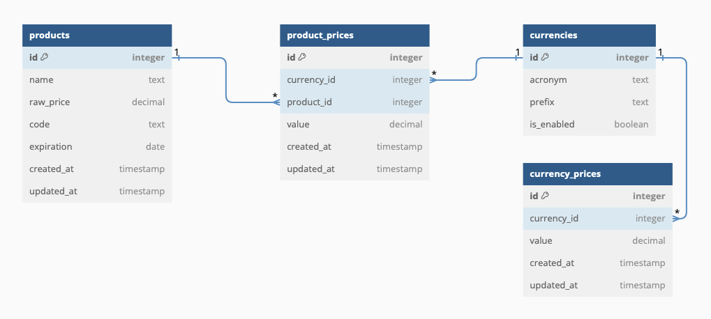

<!-- PROJECT LOGO -->
<p align="center">
<a href="http://nestjs.com/" target="blank"></a>
</p>
<p align="center">Scalable application to upload csv file on a database</p>

<!-- ABOUT THE PROJECT -->
## Description

This is an application that allows users to upload files (including larger files) to be saved in a database. It is designed to store products and currency conversions timestamped by the time of upload, but it can be easily modified to handle any type of data.

Files are processed with streams which makes it work with any size of data. There is a validation code section that allows users to define what is considered valid depending on incoming data. And, it has a good error treatment.

### Built With

* [Nest.js](https://nestjs.com)
* [PostgreSQL](https://www.postgresql.org)
* [TypeORM](https://typeorm.io)
* [Fast-CSV](https://c2fo.github.io/fast-csv/)

### Database



<!-- GETTING STARTED -->
## Getting Started

The following instructions get you a local running copy of the application.

### Prerequisites

* npm
  ```sh
  npm install npm@latest -g
  ```

### Installation

1. Clone the repo
   ```sh
   git clone https://github.com/viniciusromani/csv-uploader.git
   ```
2. Install dependencies
   ```sh
   npm install
   ```
3. Create a `.env` file on project's root folder with the following variables:
   ```sh
    NODE_ENV=development
    DATABASE_HOST=<your_database_host>
    DATABASE_PORT=<your_database_port>
    DATABASE_USER=<your_database_user>
    DATABASE_PASSWORD=<your_database_password>
    DATABASE_NAME=<your_database_name>
    PRICES_API_URL=<your_prices_api_url>
    FRONTEND_URL=<your_frontend_url>
   ```
Obs. To get currency prices, I usually use this [API](https://github.com/fawazahmed0/exchange-api)

4. Run project
   ```js
   npm run dev
   ```

### Tests

1. Run tests
   ```sh
   npm run test
   ```
2. Get unit tests coverage
   ```sh
   npm run test:cov
   ```

<!-- ROADMAP -->
## Roadmap

- [ ] Create migrations to apply database changes (currently using `syncronize: true` which is not recommended for production environment)
- [ ] Fix query-param parse on get endpoint using `class-validator` and `class-transformer` library
- [ ] Allow database batch size to be defined on the fly
- [ ] Create unit tests for `currency-service`
- [ ] Create some integration tests (there is none now)

<!-- CONTRIBUTING -->
## Contributing

Contributions are what make the open source community such an incredible place to learn, inspire, and create. Any contributions you make are **greatly appreciated**.

If you have a suggestion that would make this better, please fork the repo and create a pull request. You can also simply open an issue with the tag "enhancement".
Don't forget to give the project a star! Thanks again!

1. Fork the Project
2. Create your Feature Branch (`git checkout -b feature/AmazingFeature`)
3. Commit your Changes (`git commit -m 'Add some AmazingFeature'`)
4. Push to the Branch (`git push origin feature/AmazingFeature`)
5. Open a Pull Request

<!-- CONTACT -->
## Contact

Vinicius Romani - vn.romani@gmail.com
