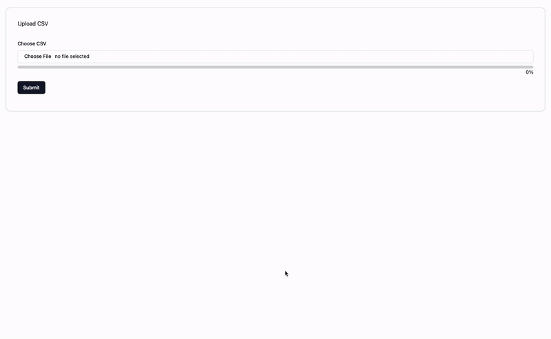

<!-- PROJECT LOGO -->
<p align="center">
<a href="https://vite.dev" target="blank"></a>
</p>
<p align="center">Scallable application to upload csv file on a database</p>

<!-- ABOUT THE PROJECT -->
## Description



This is an application that allows users to upload a files (including larger's) and save it on a database. It is designed to save products and currency conversions by the time they were uploaded but it is easily changeable to save any type of data. 

There are two main screens, the home screen is for uploading files and watching upload progress on screen. There is also a /products screen, it is still under development but it already shows all products are at the database.

### Built With

* [Vite](https://nestjs.com)
* [React](https://react.dev)
* [ShadcnUI](https://ui.shadcn.com)
* [Tailwind](https://tailwindcss.com)

<!-- GETTING STARTED -->
## Getting Started

The following instructions get you a local running copy of the application.

### Prerequisites

* npm
  ```sh
  npm install npm@latest -g
  ```

### Installation

1. Clone the repo
   ```sh
   git clone https://github.com/flatironsdevelopment/rails_node_test_viniciusromani.git
   ```
2. Install dependencies
   ```sh
   npm install
   ```
3. Create a `.env` file on project's root folder with the following variables:
   ```sh
   API_URL=<your_api_url>
   ```
4. Run project
   ```js
   npm run dev
   ```

<!-- ROADMAP -->
## Roadmap

- [ ] Implement filtering components at /products screen
- [ ] Implement sorting components at /products screen
- [ ] Shrink useStates at home screen by using an object
- [ ] Beautify UI
- [ ] Tests
    - [ ] Implement unit tests
    - [ ] Implement integration tests

<!-- CONTRIBUTING -->
## Contributing

Contributions are what make the open source community such an amazing place to learn, inspire, and create. Any contributions you make are **greatly appreciated**.

If you have a suggestion that would make this better, please fork the repo and create a pull request. You can also simply open an issue with the tag "enhancement".
Don't forget to give the project a star! Thanks again!

1. Fork the Project
2. Create your Feature Branch (`git checkout -b feature/AmazingFeature`)
3. Commit your Changes (`git commit -m 'Add some AmazingFeature'`)
4. Push to the Branch (`git push origin feature/AmazingFeature`)
5. Open a Pull Request

<!-- CONTACT -->
## Contact

Vinicius Romani - vn.romani@gmail.com
